# CodeCrafter Agent: Architecture & Guide 🏗️

Welcome to the **CodeCrafter Agent**! This system is an autonomous coding assistant that processes email requests to modify a codebase, using a dual-approval workflow for safety.

---

## 1. High-Level System Landscape 🌍

This diagram shows the "Big Picture" of how the Agent sits between the User, Developer, and external services.

```mermaid
graph TD
    %% Styling
    classDef actor fill:#e0f2fe,stroke:#0284c7,stroke-width:2px;
    classDef system fill:#f0fdf4,stroke:#16a34a,stroke-width:2px;
    classDef ext fill:#fef3c7,stroke:#d97706,stroke-width:2px;
    classDef storage fill:#f3f4f6,stroke:#6b7280,stroke-width:2px,stroke-dasharray: 5 5;

    User(👤 Requestor):::actor
    Dev(👨‍💻 Developer/Admin):::actor
    
    subgraph "External Ecosystem"
        Gmail(📧 Gmail):::ext
        GitHub(🐙 GitHub):::ext
    end

    subgraph "CodeCrafter Agent 🤖"
        Ingress(📥 Ingress Poller):::system
        Brain(🧠 Agent Brain):::system
        Exec(⚙️ Execution Engine):::system
        DB[(💽 State DB)]:::storage
    end

    %% Flows
    User -->|1. Sends Request| Gmail
    Gmail -->|2. Polls Emails| Ingress
    Ingress -->|3. Security Check| Brain
    Brain -->|4. Generates Plan| Ingress
    Ingress -->|5. Sends Plan| User
    
    User -->|6. Approves Plan| Gmail
    Ingress -->|7. Triggers Code Gen| Exec
    Exec -->|8. Modifies Files| Exec
    Exec -->|9. Runs QA| Brain
    
    Ingress -->|10. Asks for Review| Dev
    Dev -->|11. Approves Build| Gmail
    Ingress -->|12. Creates PR| GitHub
    
    Ingress -.->|Persists State| DB
```

---

## 2. Detailed Request Lifecycle (Sequence Diagram) ⏱️
A deep dive into the internal function calls during a complete ticket lifecycle.

```mermaid
sequenceDiagram
    autonumber
    
    box rgb(240, 248, 255) External World
        participant User as 👤 User
        participant Gmail as 📧 Gmail
        participant Dev as 👨‍💻 Dev
    end
    
    box rgb(255, 250, 240) CodeCrafter Agent
        participant Main as 🎮 Control (main.py)
        participant Brain as 🧠 Brain (brain.py)
        participant Tools as 🛠️ Tools (tools.py)
        participant DB as 💽 DB (state.py)
    end

    Note over Main, Gmail: Phase 1: Ingress & Security 🛡️
    
    loop Every 10s
        Main->>Gmail: Poll UNSEEN
        Gmail-->>Main: New Email
    end
    
    Main->>DB: generate_ticket_id()
    DB-->>Main: "TICKET-001"
    
    Main->>Brain: sanitize_request(body)
    Brain-->>Main: {status: "ALLOWED"}
    
    alt If Security Fails
        Main->>Dev: Alert: "COMBAT BLOCKED" 🚨
        Main->>DB: State = BLOCKED
    else Security Passes
        Note over Main, User: Phase 2: Planning 📝
        Main->>Tools: list_dir()
        Main->>Brain: analyze_request(body, files)
        Brain-->>Main: Implementation Plan
        Main->>User: Email: "Action Plan Proposed" 🔵
        Main->>DB: State = WAITING_APPROVAL
    end

    Note over Main, User: Phase 3: Execution ⚙️
    
    User->>Gmail: Reply "APPROVED"
    Gmail-->>Main: Fetch Reply
    
    Main->>Brain: generate_code(plan)
    Brain-->>Main: Code Changes
    Main->>Tools: write_to_file()
    
    Main->>Tools: get_current_diff()
    Main->>Brain: review_code(diff)
    Brain-->>Main: QA Report 🕵️‍♂️
    
    Main->>User: Email: "Build in Review" 🟡
    Main->>Dev: Email: "Code Review Request" 🟣
    Main->>DB: State = WAITING_DEV_APPROVAL

    Note over Main, GitHub: Phase 4: Completion 🚀
    
    Dev->>Gmail: Reply "APPROVE"
    Gmail-->>Main: Fetch Reply
    
    Main->>Tools: create_pr()
    Tools-->>Main: PR URL (GitHub)
    
    Main->>User: Email: "PR Created" 🟢
    Main->>DB: State = COMPLETED
```

---

## 3. Technical Reference 📚

### Core Modules
*   **`main.py`**: The central controller. Runs the `while True` loop, handles email parsing, and orchestrates the other modules.
*   **`brain.py`**: The intelligence layer. Wraps the Gemini 1.5 Flash model for:
    *   `sanitize_request()`: Security & Scope checking.
    *   `analyze_request()`: Planning.
    *   `generate_code()`: Coding.
    *   `review_code()`: QA.
*   **`state.py`**: Persistence layer. Manages `db.json` to ensure the agent remembers ticket states across restarts.
*   **`tools.py`**: System interface. Handles `git` operations, file reading/writing, and listing directories.

### State Machine (`db.json`)
The agent moves a ticket through these specific states:
1.  **`NEW`**: Initial ingress.
2.  **`WAITING_APPROVAL`**: Plan sent to User.
3.  **`WAITING_DEV_APPROVAL`**: Code built, QA run, sent to Developer.
4.  **`COMPLETED`**: PR created. (Terminal)
5.  **`BLOCKED`**: Security violation. (Terminal)

---

## 4. Debugging & Logs 🐞
*   **Live Console**: Shows real-time processing: `Processing... | Ticket: TICKET-001 | State: NEW`.
*   **`db.json`**: The source of truth for all active threads.
*   **`dashboard_log.json`**: A simplified log of completed tickets for reporting.
